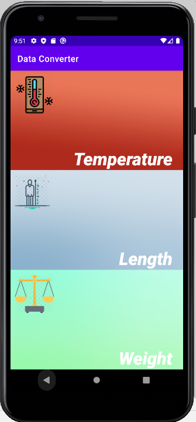
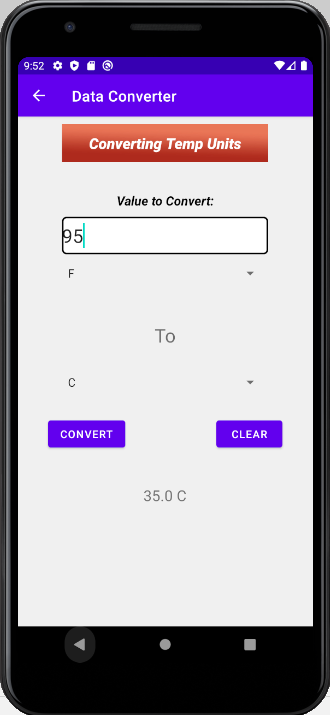

# Data Convertor (Android)

This is a simple, lightweight Android App that converts units of temperature, length, and weight. The following are a list of the units it can convert between.  
* Temperature (celsius, fahrenheit, kelvin)
* Length (km, cm, mm, ft, in, yd, mi, etc.)
* Weight (kg, g, lb, oz, etc.)
 

## Thoughts
This is my first Android application I've created and I really had a bunch of fun creating it! 
My favorite part of the process was the whole design of the layout. Because this app serves a basic function, there wasn't much to add within the app itself.
However, after some thinking and drafting, I think the layout is simple yet stylish. 
This project taught me the fundamentals of Android Studio and XML. With this, I hope to continue developing more Android Apps in the future! P.S. There are pictures of the app below!
 
 
 
 

  
  

